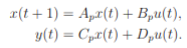
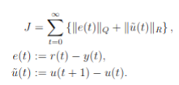

# preview-control
Preview control augments state feedback techniques to use future points from the reference trajectory. Specifically, instead of the state feedback u = -kx, we use the feedback law u = -k [x; ref], where ref is a fixed-length preview of the reference. This repo implements the requisite state augmentation and lets you directly design a preview LQI controller.


For a randomly generated 4-order system, the image shows the simulation with different preview lengths i corresponding to y_i, u_i. We see that adding preview improves the rise time and settling time.

## Use

The control design provides a type-1 controller with good transient response for the system



in the sense of minimizing



The library provides the following workflow:

```
import preview_control

# Define the system
Ap = np.array([
    [0.9752, 0.0248, 0.1983, 0.0017],
    [0.0248, 0.9752, 0.0017, 0.1983],
    [-0.2459, 0.2459, 0.9752, 0.0248],
    [0.2459, -0.2459, 0.0248, 0.9752],
])
Bp = np.array([
    [-0.0199],
    [-0.0001],
    [-0.1983],
    [-0.0017],
])
Cp = np.array([[0.0, 1.0, 0.0, 0.0]])
Dp = np.array([[0.0]])

# Define the reference. Use a step.
ts = range(80)
rs = [np.zeros(shape=(Cp.shape[0], 1)) if t < 25 else np.ones(shape=(Cp.shape[0], 1)) for t in ts]
get_ref = lambda i, h: np.array([rs[j] if j<len(rs) else rs[-1] for j in range(i, i+h+1)]).reshape(-1, 1)

# Define control objective function. We penalize the system error
# 20x more than the control difference.
Q = np.array([[20.0]])
R = np.array([[1.0]])

# Design a controller with no preview
controller = preview_control.controller.LQRController(Ap, Bp, Cp, Dp, Q, R), ts

# Design a controller with 5 preview steps
p_controller = preview_control.controller.LQRPreviewController(Ap, Bp, Cp, Dp, Q, R, h=5)

# Simulate the result
xs, ys, us = test.simulate(p_controller, ts)
```

## Install
The requirements are `numpy`, `scipy`, and `control`.

To install slycot, the following may be necessary:

```
pip install python3.13-dev
python3.13 -m venv venv
source venv/bin/activate
cd ./venv/bin
ln -s f2py f2py3
cd ../..
pip install slycot
```

See [slycot #239](https://github.com/python-control/Slycot/issues/239)

## Todo
- H-infinity formulation
- Test MIMO systems

## Reference
The implementation is based on "A tutorial on preview control systems", Tabaka (2003).
